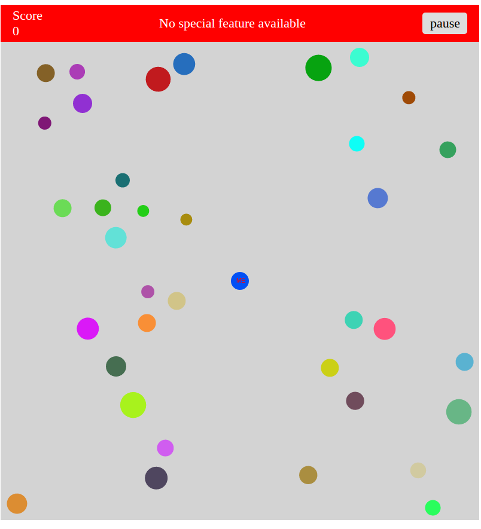
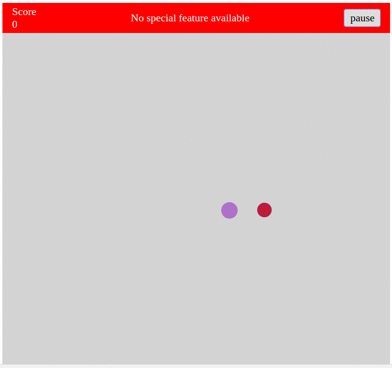
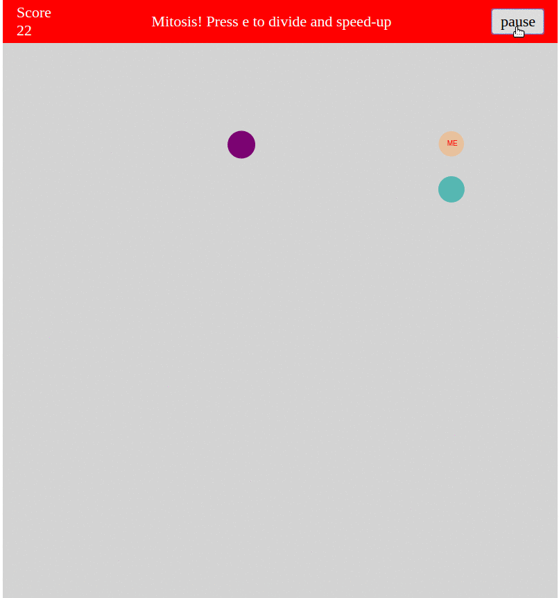
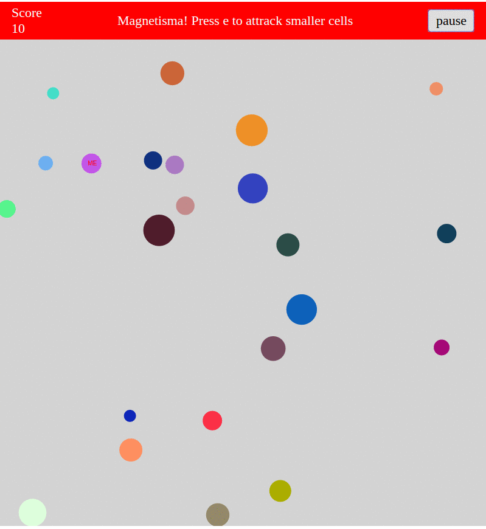
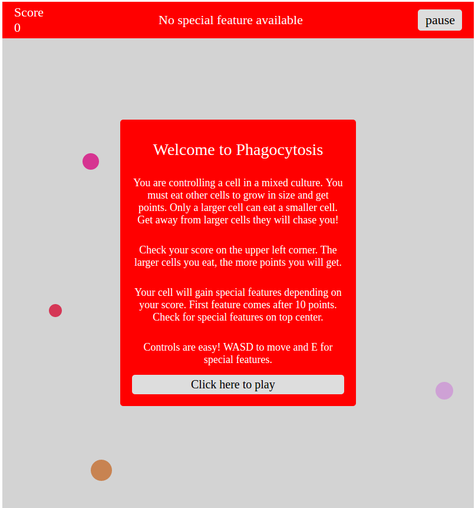

# Phagocytosis

[Phagocytosis live][live]

[live]: http://hcoban.github.io/phagocytosis

Phagocytosis is a single-player game inspired by agar.io. and developed on javascript. The game is rendered on a rectangle representing an 2-d culture of living cells. Cells have a circular shape with varying radii. The game rules are as follows:

- Cells grow by engulfing (eating) other cells which are smaller in radius. Engulfing occurs when two cells are in contact.
- The larger a cell is, the slower it becomes.
- Engulfing larger cells brings more points.
- After having certain points, player's cell is granted for additional features which are
  - `mitosis`: cell divide into two smaller cells in order to speed-up.
  - `magnetism`: player's cell attracts smaller cells so that the smaller cells will move towards the player's cell.
  - `sporing`: the cell gains resistance to be eaten for a certain time.

## Features & Implementation

### Dynamic rendering

Phagocytosis game is rendered dynamically using javascript and jquery. After the page content is loaded, a webpack entry file creates a canvas context and instances of `Game`, `GameView`, `Header`, and `Modal` classes.

Player's cell is generated at the center whereas other cells are generated at random locations. However, there is a safe zone around the player's cell where other cells cannot be generated. This is implemented in order to prevent immediate losing of game and also to provide the player time for adapting to controls.



### AI

Other cells (cells which are controlled by AI) are moving depending on the presence of a nearby cell. Cells do not move if there is no nearby cell. This approach simulated user control in a more realistic way than random movement.

```javascript
move(timeDelta) {
  ...
  if (this.nearest()) {
    vec = Util.scale(Util.changeVec(this, this.nearest()), 5/this.radius);
  } else {
    vec = [0, 0];
  }
  ...
}
```

Depending on the size of the nearest cell, next position will be either one step closer to or farther from it. Offsets for x- and y-axises is determined by the velocity of the cell and the time passed since the last move. This approach keeps the speed of cells stable which is necessary to keep size-speed balance.

```javascript
...
if (this.radius > this.nearest().radius) {
  newPos = [this.pos[0] + offsetX, this.pos[1] + offsetY];
} else {
  newPos = [this.pos[0] - offsetX, this.pos[1] - offsetY];
}
...
```

An example of chasing is shown below.



### Special features

Special features are available after reaching to certain points and are activated with one `keydown` event.    

One of the special features is `mitosis` (cell division). This shrinks the cell by division into two equal cells so that it moves faster.



This feature is implemented by simply decreasing the radius and creating a sibling.

```javascript
divide() {
  this.radius = this.radius/2;
  let pos = [(this.pos[0]- 2* this.radius), (this.pos[1] - 2 * this.radius)];
  let sibling = new PlayCell({radius: this.radius, pos: pos, color: "black", game: this.game});
  this.game.add(sibling);
}
```

Another feature is `magnetism` which moves smaller cells towards the player's cell. It modifies the `move` function by replacing nearest cell with player's cell and results in the following behavior.



### Modal

A `Modal` class is implemented to guide the player at the beginning and at the end of the game. Game controls are also included in the modal.



## Future Directions

The following features are anticipated to be implemented.
- Sharing score on facebook, twitter
- flagellum attack: the cell will have a wipe-like weapon to freeze/kill/scare other cells upon click. The rendering of flagellum has been already implemented for testing purposes. I will decide about its functionality.
- Engulfing animation: Cell collision can be animated as engulfing instead of simple contact.
- Antibiotic drop: A drop of antibiotic will occur on a random location and spread with time. Rendering of spreading antibiotic will require gradient-coloring. Player will need to eat antibiotic-resistant cells in order to gain resistance and survive the spreading antibiotic.
